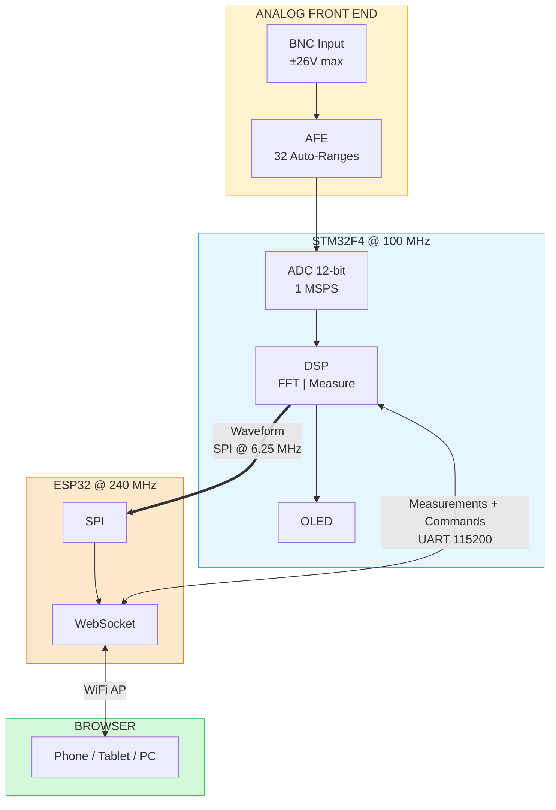
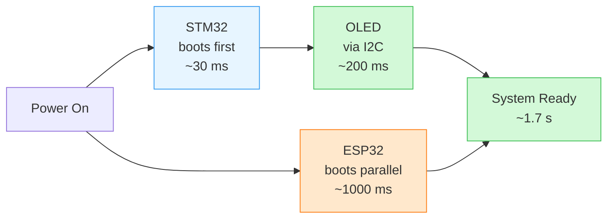
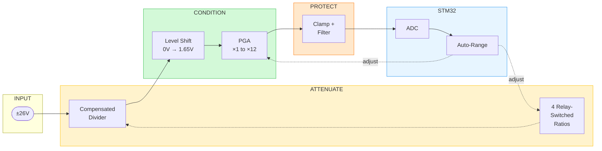

# Smart Wireless Oscilloscope

> Dual-MCU oscilloscope with real-time FFT, auto-ranging analog front end, and wireless browser-based display.

  

---

## Specifications

| Parameter | Value |
|-----------|-------|
| Sample Rate | 1 MSPS |
| Resolution | 12-bit |
| Bandwidth | DC — 500 kHz |
| Input Range | ±137 mV to ±26 V (32 auto-selected ranges) |
| Input Impedance | 100 kΩ — 1 MΩ (range-dependent) |
| FFT | 4096-point |
| Connectivity | WiFi AP + WebSocket |
| Display | 128×64 OLED + Browser |

---

## System Architecture

**Dual-MCU rationale:**
- **STM32F4**: Real-time sampling and DSP — timing-critical, cannot tolerate WiFi stack jitter
- **ESP32**: Wireless connectivity — creates WiFi AP, streams data via WebSocket at 20 FPS

No router needed. No software installation. Connect to the oscilloscope's WiFi and open a browser.

Power Sequencing

| Event | Time |
|-------|------|
| STM32 GPIO safe | ~30 ms |
| OLED splash | ~200 ms |
| ESP32 WiFi ready | ~1000 ms |
| System ready | ~1.7 s |

---

## Features

- **Wireless Display**: Access from any browser — phone, tablet, or PC
- **Auto-Ranging**: 32 gain settings, hardware-safe boot, 10 ms adaptation
- **Acquisition**: Timer-triggered ADC with DMA (Normal, Average, Peak Detect)
- **Analysis**: Real-time 4096-point FFT, auto-measurements (Freq, Vpp, Vrms, Duty)
- **Generator**: PWM output 1 Hz — 100 kHz, variable duty cycle
- **Local Display**: 128×64 OLED for standalone operation

---

## Analog Front End

**Constraints:** Single 3.3V supply | Survives ±26V input | 500 kHz bandwidth (flat across all gains)

### Signal Chain

**How it works:**
1. **Attenuator** — Relay-switched compensated divider (÷1 to ÷16) handles high voltage
2. **Level shift** — Inverting stage (×−1) translates bipolar signal to 1.65V center
3. **PGA** — Mux-selected feedback sets gain (×1–×12) with bandwidth-matched caps
4. **Protection** — Schottky clamps + RC filter; hardware pull-downs ensure safe boot

MCU monitors ADC codes and steps through 32 combinations (4 divider × 8 PGA) automatically.

### Schematic

  

---

### Auto-Ranging

| Condition | Action |
|-----------|--------|
| ADC near rails (>97% or <3%) | Reduce gain |
| Signal too small (<25%) | Increase gain |
| Optimal | Hold |

Runs every 10 ms with hysteresis. Boot default: ÷16, ×1 (maximum attenuation).

Range Table

**Attenuator (relay-switched):**

| Relay | R_bot | Ratio | C_top |
|:-----:|:-----:|:-----:|:-----:|
| K0 | 6.81 kΩ | ÷15.7 | 2.2 pF |
| K1 | 21.5 kΩ | ÷5.65 | 5.6 pF |
| K2 | 75 kΩ | ÷2.33 | 15 pF |
| K3 | Bypass | ÷1 | — |

**PGA (mux-switched):**

| Ch | R_f | Gain | C_f | BW |
|:--:|:---:|:----:|:---:|:--:|
| 0 | 10k | ×1 | 33p | 480 kHz |
| 1 | 20k | ×2 | 15p | 530 kHz |
| 2 | 30.1k | ×3 | 10p | 530 kHz |
| 3 | 40.2k | ×4 | 8.2p | 480 kHz |
| 4 | 49.9k | ×5 | 6.8p | 470 kHz |
| 5 | 60.4k | ×6 | 5.6p | 470 kHz |
| 6 | 80.6k | ×8 | 3.9p | 510 kHz |
| 7 | 121k | ×12 | 2.7p | 490 kHz |

**Example combinations:**

| Atten | PGA | Total Gain | Input Range | Resolution |
|:-----:|:---:|:----------:|:-----------:|:----------:|
| ÷15.7 | ×1 | 0.064 | ±25.9 V | 12.7 mV/LSB |
| ÷5.65 | ×2 | 0.35 | ±4.7 V | 2.3 mV/LSB |
| ÷1 | ×12 | 12 | ±137 mV | 67 µV/LSB |

Design Decisions

| Choice | Rationale |
|--------|-----------|
| Relays for attenuator | Low R_on, no distortion, handles ±26V |
| Compensated divider | Flat response despite capacitive loading |
| Inverting topology | Constant BW and input impedance across gains |
| Matched R_f × C_f | Same ~500 kHz bandwidth at all PGA settings |
| Fixed 22pF C_bot | Absorbs strays into stable NP0 value |

---

## Known Limitations

| Issue | Impact | Status |
|-------|--------|--------|
| No voltage calibration | ±5% accuracy | Future |
| Software trigger only | May miss fast transients | Future |

---

## Hardware

  

Bill of Materials

| Ref | Component | Value | Purpose |
|-----|-----------|-------|---------|
| U1 | STM32F411CEU6 | — | Main MCU |
| U2 | ESP32-WROOM-32 | — | WiFi bridge |
| U3, U4 | Rail-to-rail op-amp | — | Level shift + PGA |
| U5 | CD74HC4051 | — | PGA gain mux |
| U6 | CD74HC238 | — | Relay decoder |
| U7 | ULN2003A | — | Relay driver |
| U8 | AP2112K-3.3 | — | LDO |
| U9 | SSD1306 | 128×64 | OLED |
| K0–K3 | DPDT relay | 5V coil | Attenuator |
| D1, D2 | BAT54S | — | Schottky clamps |
| — | Resistors | 6.81k–121k | Divider + PGA |
| — | Capacitors | 2.2p–33p NP0 | Compensation |

**Estimated BOM: ~$15**

---

## License

MIT License — See [LICENSE](LICENSE)

---

  <b>Built by Mohammad Reza Safaeian</b>  
  <a href="mailto:your@email.com">Email</a>

