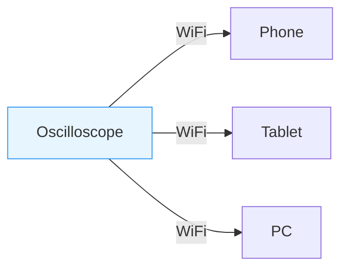
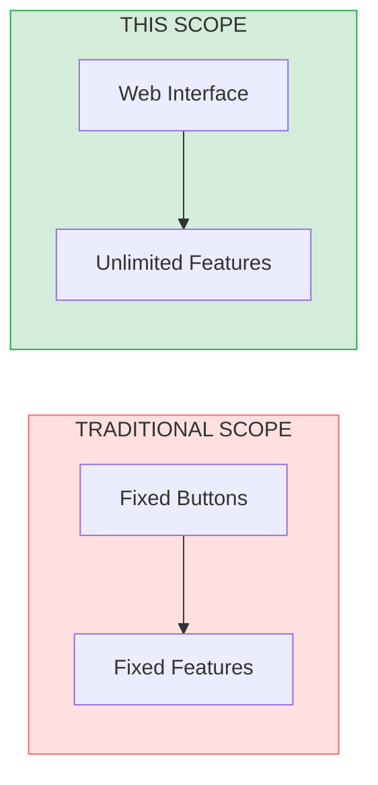
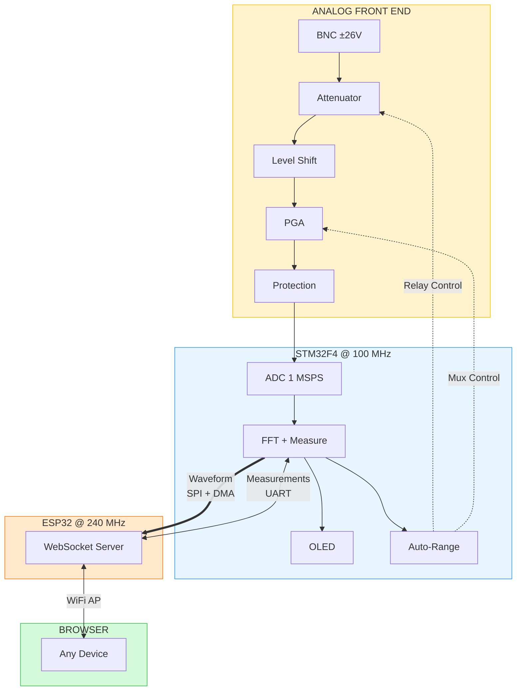
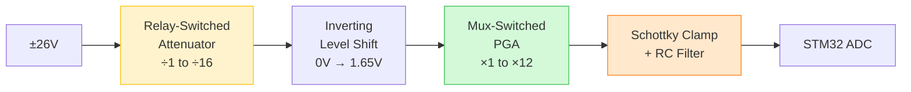

# Smart Wireless Oscilloscope

> No software. No cables. Connect to WiFi, open browser, measure signals.

  

---

## The Problem

Traditional oscilloscopes require dedicated software, USB cables, driver configuration, and being physically next to the device. Their features are limited by fixed buttons and hardcoded firmware.

---

## The Solution

Power on → Connect to WiFi → Open browser → Measure.

**No software. No cables. No drivers.**

---

## Why Web-Based Matters

The hardware is the platform. The web interface is where intelligence lives.

**Current features:** Auto-ranging with SNR optimization, FFT peak detection, auto-measurements, adaptive streaming, multi-client viewing (8 simultaneous)

**Future additions (no hardware changes):** Protocol decoding, cloud logging, automated testing, remote lab access, AI-assisted anomaly detection

---

## Specifications

| Parameter | Value |
|-----------|-------|
| Sample Rate | 1 MSPS |
| Resolution | 12-bit |
| Bandwidth | DC — 500 kHz (flat across all gains) |
| Input Range | ±137 mV to ±26 V (auto-selected) |
| FFT | 4096-point, top 5 peaks detected |
| Generator | PWM 1 Hz – 100 kHz, 1–99% duty |
| Display | Browser + 128×64 OLED |

---

## Smart Features

| Feature | Description |
|---------|-------------|
| Auto-ranging | 32 gain settings, optimizes for best SNR |
| FFT peak detection | Identifies top 5 frequency components on spectrum |
| Auto-measurements | Real-time frequency, Vpp, Vrms, duty cycle |
| Adaptive streaming | Adjusts frame rate (20/7/1 FPS) based on client load |
| Safe boot | Hardware pull-downs force max attenuation at power-on |
| Auto-recovery | Detects frozen clients, reconnects automatically |

---

## System Architecture

| Component | Role |
|-----------|------|
| STM32F411 | Sampling, DSP, measurements, AFE control |
| ESP32 | WiFi AP, WebSocket streaming, web UI hosting |
| Dual-MCU | Isolates timing-critical DSP from WiFi jitter |

---

## Analog Front End

**Constraints:** Single 3.3V supply | Survives ±26V | 500 kHz bandwidth

| Stage | Implementation |
|-------|----------------|
| Attenuator | 4 relay-switched compensated dividers (flat frequency response) |
| Level Shift | Inverting stage, translates bipolar to 1.65V center |
| PGA | 8 mux-switched gains with bandwidth-matched caps (~500 kHz all settings) |
| Protection | Schottky clamps, RC filter, hardware pull-downs for safe boot |

### Auto-Ranging Strategy

STM32 monitors ADC codes and adjusts gain to **maximize SNR without clipping:**

| Signal Level | Path | Rationale |
|--------------|------|-----------|
| Large (>1.65V) | Attenuator ÷2–÷16, PGA ×1 | Attenuate only, avoid amplifier noise |
| Medium (~1V) | Bypass ÷1, PGA ×1 | Direct path |
| Small (<500mV) | Bypass ÷1, PGA ×2–×12 | Amplify to fill ADC range |

Runs every 10 ms with hysteresis. Boot default: maximum attenuation.

Range Examples

| Input Range | Attenuator | PGA | Total Gain |
|:-----------:|:----------:|:---:|:----------:|
| ±25.9 V | ÷15.7 | ×1 | 0.064 |
| ±9.3 V | ÷5.65 | ×1 | 0.177 |
| ±1.65 V | ÷1 | ×1 | 1 |
| ±412 mV | ÷1 | ×4 | 4 |
| ±137 mV | ÷1 | ×12 | 12 |

PGA gain >×1 only when attenuator bypassed — minimizes noise contribution.

Schematic

  

[Download PDF](Hardware/afe_schematic.pdf)

---

## Implementation

### STM32F411

| Category | Implementation |
|----------|----------------|
| Peripherals | ADC+DMA, TIM2 (trigger), TIM3 (PWM), SPI+DMA, UART, I2C |
| Architecture | Event-driven superloop with DMA completion flags |
| Acquisition | Timer-triggered ADC, 10 Hz – 1 MSPS dynamic |
| DSP | ARM CMSIS 4096-pt FFT, Hanning window, EMA filtering |
| Measurements | Zero-crossing frequency, Vpp, Vrms, top 5 FFT peaks |
| Decimation | Normal, Average, Peak Detect modes |
| Generator | PWM 1 Hz – 100 kHz, 1–99% duty, dynamic prescaler |

### ESP32

| Category | Implementation |
|----------|----------------|
| Network | WiFi AP (192.168.4.1), AsyncWebSocket, 8 concurrent clients |
| Streaming | SPI → Binary WebSocket → HTML5 Canvas @ 20 FPS |
| Throttling | 3-tier adaptive (20/7/1 FPS) based on error rate |
| Recovery | Per-client tracking, browser freeze detection (5s timeout) |

### Design Decisions

| Decision | Rationale |
|----------|-----------|
| Web-based interface | Unlimited features via software, no hardware changes |
| WiFi AP mode | Works anywhere, no router needed |
| Dual-MCU | Real-time DSP isolated from WiFi stack jitter |
| DMA everywhere | Zero CPU overhead for ADC and SPI |
| Compensated dividers | Flat frequency response across attenuation |
| Matched PGA bandwidth | Consistent 500 kHz at all gain settings |
| Adaptive streaming | Graceful degradation, prevents client overload |

---

## Demo

https://github.com/user/repo/raw/main/docs/demo.mp4

---

## Hardware

  

Bill of Materials ~$15

| Component | Purpose |
|-----------|---------|
| STM32F411 | Main MCU: acquisition, DSP, AFE control |
| ESP32 | WiFi AP, WebSocket, web UI hosting |
| Rail-to-rail op-amps | Level shift + PGA stages |
| CD74HC4051 | PGA gain mux (8 channels) |
| CD74HC238 + ULN2003A | Relay decoder + driver |
| DPDT relays (×4) | Attenuator switching |
| SSD1306 OLED | Local display |
| BAT54S | Schottky input protection |

---

## Known Limitations

| Issue | Status |
|-------|--------|
| No voltage calibration (±5% accuracy) | Future |
| Software trigger only | Future |

---

## License

MIT — See [LICENSE](LICENSE)

---

  <b>Built by Mohammad Reza Safaeian</b> 
  <a href="mailto:mohammad.rsafaeian@gmail.com">Email</a>

