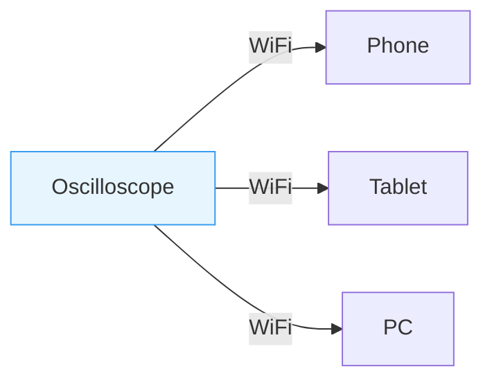
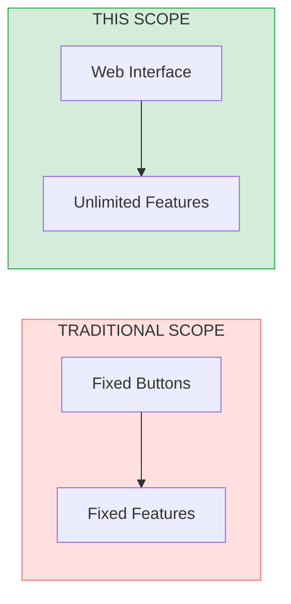
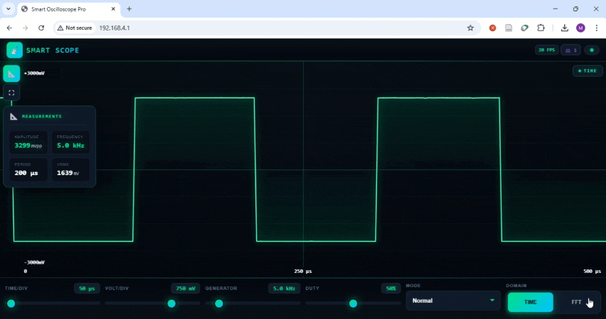
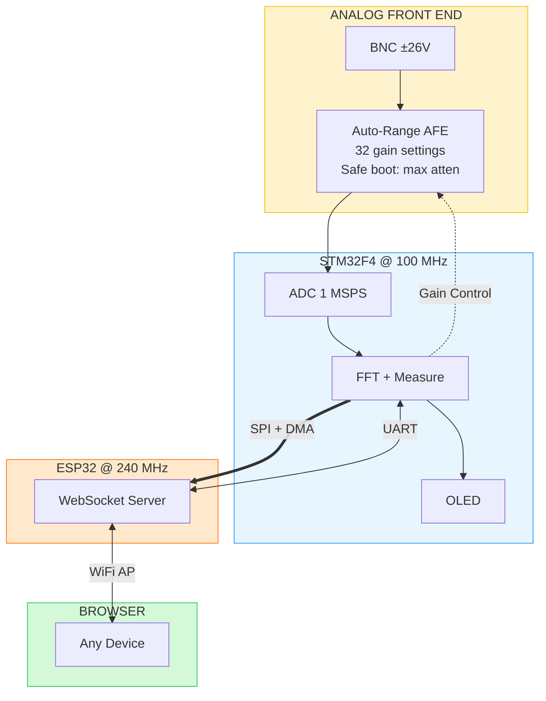
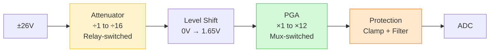

# Smart Wireless Oscilloscope

> No software. No cables. Connect to WiFi, open browser, measure signals.


<p align="center">
  
</p>

---

## The Problem

Traditional oscilloscopes require dedicated software, USB cables, driver configuration, and being physically next to the device. Their features are limited by fixed buttons and hardcoded firmware.

---

## The Solution



Power on → Connect to WiFi → Open browser → Measure.

**No software. No cables. No drivers.**

---

## Why Web-Based Matters



The hardware is the platform. The web interface is where intelligence lives.

**Current features:** Auto-ranging with SNR optimization, FFT peak detection, auto-measurements, adaptive streaming, multi-client viewing, internal signal generator for self-test

**Future additions (no hardware changes):** Protocol decoding, cloud logging, automated testing, remote lab access, AI-assisted anomaly detection

---

## Demo

### Time Domain Analysis

Waveform capture and auto-measurements using the internal signal generator:

<p align="center">
  
</p>

### Frequency Domain Analysis

FFT spectrum with peak detection using the internal signal generator:

<p align="center">
  
</p>

### External Signal Test

Full system test measuring audio signal from a phone:

<p align="center">
  <a href="https://youtube.com/watch?v=YOUR_VIDEO_ID">
    
  </a>
  <br>
  <b>▶ Watch full demo</b>
</p>

---

## Specifications

| Parameter | Value |
|-----------|-------|
| Sample Rate | 1 MSPS |
| Resolution | 12-bit |
| Bandwidth | DC — 500 kHz |
| Input Range | ±137 mV to ±26 V (auto) |
| FFT | 4096-point, top 5 peaks |
| Generator | PWM 1 Hz – 100 kHz |
| Display | Browser + OLED |

---

## System Architecture



| Component | Role |
|-----------|------|
| STM32F411 | Sampling, DSP, measurements, AFE control |
| ESP32 | WiFi AP, WebSocket streaming, web UI |
| Dual-MCU | Isolates real-time DSP from WiFi jitter |

---

## Analog Front End

**Constraints:** Single 3.3V supply | Survives ±26V | 500 kHz bandwidth



| Stage | Function |
|-------|----------|
| Attenuator | 4 relay-switched compensated dividers |
| Level Shift | Translates bipolar to 1.65V center |
| PGA | 8 mux-switched gains, bandwidth-matched |
| Protection | Schottky clamps, RC filter |

### Auto-Ranging

STM32 adjusts gain to **maximize SNR without clipping:**

| Signal | Strategy |
|--------|----------|
| Large (>1.65V) | Attenuate only, PGA ×1 |
| Medium | Direct path |
| Small (<500mV) | Amplify with PGA |

**Safe boot:** Hardware pull-downs force maximum attenuation before MCU initializes — ADC protected even if ±26V applied at power-on.

<details>
<summary>Range Examples</summary>

| Input Range | Attenuator | PGA | Total Gain |
|:-----------:|:----------:|:---:|:----------:|
| ±25.9 V | ÷15.7 | ×1 | 0.064 |
| ±9.3 V | ÷5.65 | ×1 | 0.177 |
| ±1.65 V | ÷1 | ×1 | 1 |
| ±412 mV | ÷1 | ×4 | 4 |
| ±137 mV | ÷1 | ×12 | 12 |

</details>

<details>
<summary>Schematic</summary>

<p align="center">
  
</p>

[Download PDF](Hardware/afe_schematic.pdf)

</details>

---

## Implementation

### STM32F411

| Category | Implementation |
|----------|----------------|
| Acquisition | Timer-triggered ADC + DMA, 10 Hz – 1 MSPS |
| DSP | ARM CMSIS 4096-pt FFT, Hanning window |
| Measurements | Frequency, Vpp, Vrms, top 5 FFT peaks |
| Decimation | Normal, Average, Peak Detect modes |
| Generator | PWM 1 Hz – 100 kHz, 1–99% duty |

### ESP32

| Category | Implementation |
|----------|----------------|
| Network | WiFi AP (192.168.4.1), WebSocket, 8 clients |
| Streaming | Binary WebSocket → Canvas @ 20 FPS |
| Resilience | Adaptive throttling, auto-reconnect |

### Design Decisions

| Decision | Rationale |
|----------|-----------|
| Web-based | Unlimited features, no install |
| WiFi AP | Works anywhere, no router |
| Dual-MCU | DSP isolated from WiFi jitter |
| DMA | Zero CPU overhead |
| Hardware safe boot | ADC protected before firmware runs |
| Internal generator | Self-test capability, no external equipment needed |

---

## Hardware

<p align="center">
  
</p>

<details>
<summary>Bill of Materials ~$15</summary>

| Component | Purpose |
|-----------|---------|
| STM32F411 | MCU: acquisition, DSP, control |
| ESP32 | WiFi, WebSocket, web UI |
| Op-amps + CD74HC4051 | AFE signal conditioning |
| CD74HC238 + ULN2003A | Relay control |
| DPDT relays (×4) | Attenuator |
| SSD1306 OLED | Local display |
| BAT54S | Input protection |

</details>

---

## Known Limitations

| Issue | Status |
|-------|--------|
| No voltage calibration (±5%) | Future |
| Software trigger only | Future |

---

## License

MIT — See [LICENSE](LICENSE)

---

<p align="center">
  <b>Built by Mohammad Reza Safaeian</b><br>
  <a href="mailto:mohammad.rsafaeian@gmail.com">Email</a>
</p>
```
