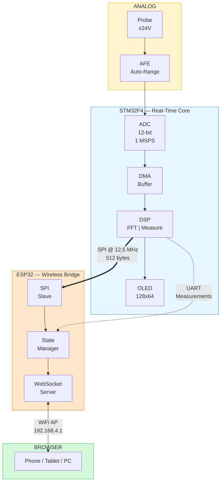
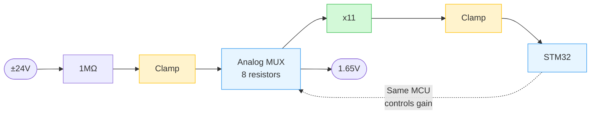

# Smart Wireless Oscilloscope

> Dual-MCU oscilloscope with real-time FFT, auto-ranging input, and wireless browser-based display.


<p align="center">
  
</p>

---

## Specifications

| Parameter | Value |
|-----------|-------|
| Sample Rate | 1 MSPS |
| Resolution | 12-bit |
| Bandwidth | DC — 100 kHz |
| Input Range | ±24V (auto-ranging) |
| Input Impedance | 1 MΩ |
| FFT | 4096-point |
| Connectivity | WiFi AP + WebSocket |
| Display | 128×64 OLED + Browser |

---

## System Architecture



**Dual-MCU rationale:**
- **STM32F4**: Real-time sampling and DSP — timing-critical, cannot tolerate WiFi stack jitter
- **ESP32**: Wireless connectivity — creates WiFi AP, streams data via WebSocket at 20 FPS

No router needed. No software installation. Connect to the oscilloscope's WiFi and open a browser.

---

## Features

- **Wireless Display**: Access from any browser — phone, tablet, or PC
- **Acquisition**: Timer-triggered ADC with DMA, three modes (Normal, Average, Peak Detect)
- **Analysis**: Real-time FFT with Hanning window, auto-measurements (Frequency, Vpp, Vrms, Duty Cycle)
- **Generator**: PWM output 1 Hz — 100 kHz, variable duty cycle
- **Local Display**: 128×64 OLED for standalone operation

---

## Analog Front End

**Constraints:** Under $10 BOM | Single 3.3V supply | Survives ±24V input

### Signal Chain



**How it works:** R1 (fixed) and the MUX-selected resistor form a voltage divider. The STM32 samples the signal, detects clipping or weakness, and switches resistors via GPIO — auto-ranging from ±24V down to ±150mV.

### Schematic

<p align="center">
  
</p>

### Auto-Ranging

| Signal | Action |
|--------|--------|
| Clipping | Lower gain (select smaller resistor) |
| Too weak | Raise gain (select larger resistor or open) |
| Optimal | Hold current range |

Runs every 10ms with hysteresis to prevent rapid switching.

Boot default: Maximum attenuation (CH0) — safe even if ±24V applied before code runs.

<details>
<summary>Gain Ranges</summary>

| Channel | Divider R | Net Gain | Input Range | Notes |
|:-------:|:---------:|:--------:|:-----------:|-------|
| 0 | 10 kΩ | x0.11 | ±24V | Boot default (safe) |
| 1 | 20 kΩ | x0.22 | ±12V | |
| 2 | 50 kΩ | x0.55 | ±5V | |
| 3 | 100 kΩ | x1.1 | ±2.5V | |
| 4 | 200 kΩ | x2.2 | ±1.2V | |
| 5 | 500 kΩ | x5.5 | ±500mV | |
| 6 | 1 MΩ | x11 | ±250mV | |
| 7 | Open | x11 | ±150mV | Direct to amp, max sensitivity |

</details>

<details>
<summary>Protection Philosophy</summary>

**Four-layer defense:**

| Layer | Component | Protects | Against |
|:-----:|-----------|----------|---------|
| 1 | R1 (1MΩ) | All downstream | Overcurrent — limits to 24µA |
| 2 | D1 (BAT54S) | MUX inputs | Overvoltage at input node |
| 3 | Boot Default | ADC | Wrong range — GPIO=000 selects CH0 |
| 4 | D2 (BAT54S) | ADC | Op-amp faults, overshoot, glitches |

ADC is protected even if ±24V applied before MCU boots.

</details>

> **Scalability:** Architecture supports extension to ±220V with input divider, CD4067 (16-ch MUX), and galvanic isolation.

---

## Known Limitations

| Issue | Impact | Status |
|-------|--------|--------|
| Timebase inaccuracy < 50 µs/div | Displays 2.56x more time than labeled | Documented |
| No voltage calibration | ±5% accuracy | Future |
| Software trigger only | May miss fast transients | Future |

---

## Build Instructions

```bash
# Clone
git clone https://github.com/yourusername/smart-oscilloscope
cd smart-oscilloscope

# STM32
cd firmware/stm32
make
st-flash write build/scope.bin 0x8000000

# ESP32
cd ../esp32
pio run -t upload         # Firmware
pio run -t uploadfs       # Web UI
```

**Usage:**
1. Power on
2. Connect to WiFi: `SmartScope-Pro` / `12345678`
3. Open browser: `http://192.168.4.1`

---

## Project Structure

```
smart-oscilloscope/
├── firmware/
│   ├── stm32/
│   │   └── Core/Src/
│   │       ├── main.c .............. Main loop
│   │       ├── osc_signal.c ........ DSP algorithms
│   │       └── osc_display.c ....... OLED rendering
│   └── esp32/
│       ├── src/
│       │   ├── main.cpp ............ WebSocket server
│       │   ├── spi.cpp ............. SPI slave
│       │   └── uart_handler.cpp .... Measurement parser
│       └── data/
│           └── index.html .......... Web UI
├── hardware/
│   ├── afe_schematic.svg
│   └── bom.csv
└── docs/
    ├── demo.gif
    └── hardware.jpg
```

---

## Hardware

<p align="center">
  
</p>

<details>
<summary>Bill of Materials</summary>

| Ref | Component | Value | Purpose |
|-----|-----------|-------|---------|
| U1 | STM32F411CEU6 | — | Main MCU |
| U2 | ESP32-WROOM-32 | — | WiFi bridge |
| U3 | MCP6002 | — | Op-amp (x11 gain) |
| U4 | CD4051 | — | 8:1 Analog MUX |
| U5 | SSD1306 | 128×64 | OLED display |
| D1, D2 | BAT54S | — | Protection clamps |
| R1 | Resistor | 1MΩ | Input impedance |
| R3, R4 | Resistors | 100k, 10k | Gain setting |
| — | Resistors | 10k—1M | Divider ladder (7 pcs) |

**Estimated BOM: ~$12**

</details>

---

## What I Learned

- **Multi-MCU architecture**: Separating real-time and networking tasks
- **Wireless data streaming**: WebSocket for real-time embedded applications
- **Analog signal conditioning**: Protection, auto-ranging, virtual ground biasing
- **DSP fundamentals**: FFT windowing, EMA filtering, frequency measurement

---

## Future Work

- [ ] EEPROM calibration routine
- [ ] Hardware trigger (comparator)
- [ ] Protocol decoder (UART, I2C, SPI)
- [ ] Battery operation

---

## License

MIT License — See [LICENSE](LICENSE)

---

<p align="center">
  <b>Built by [Your Name]</b><br><br>
  <a href="https://linkedin.com/in/yourprofile">LinkedIn</a> ·
  <a href="mailto:your@email.com">Email</a> ·
  <a href="https://yourportfolio.com">Portfolio</a>
</p>
```

---

