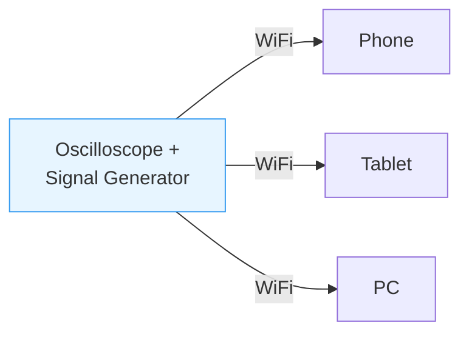
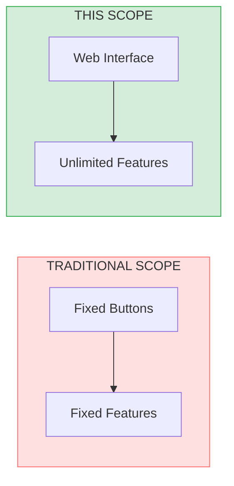
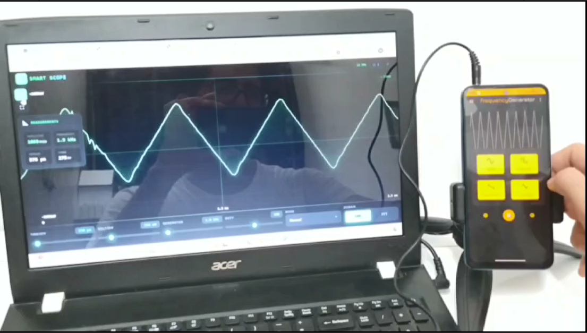
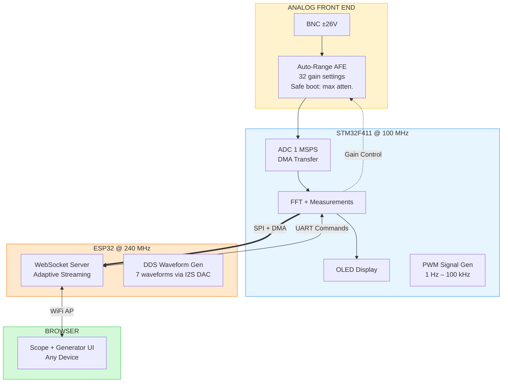
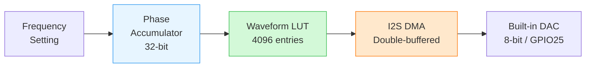
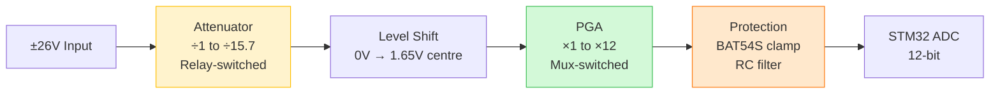
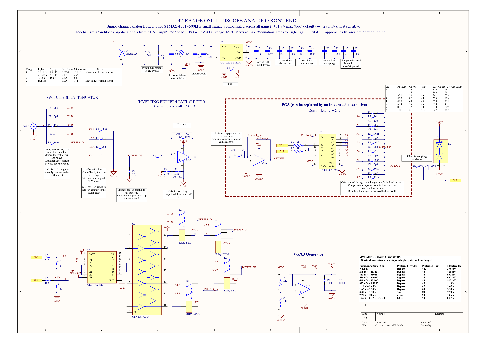
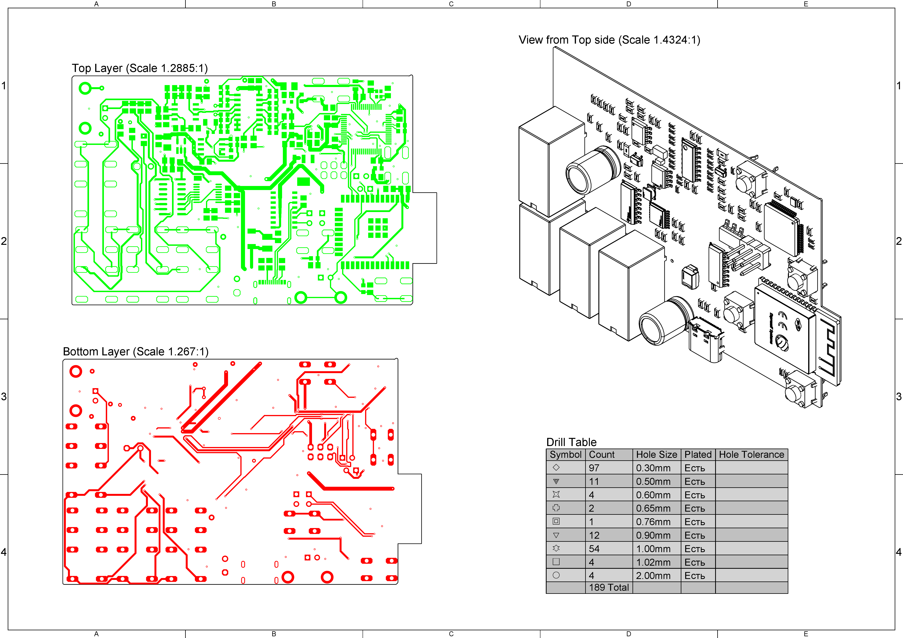
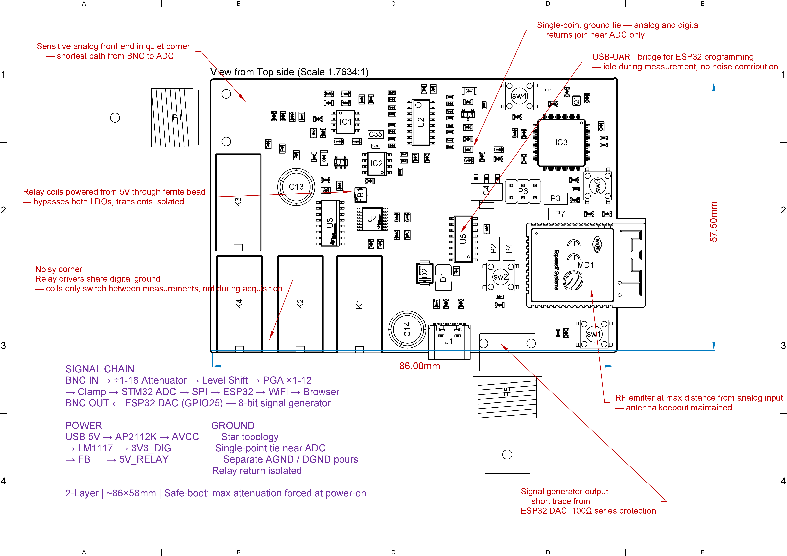

# WiFi Oscilloscope + Signal Generator — Custom PCB, ~$7 BOM

> A complete 1 MSPS oscilloscope with FFT spectrum analyzer and 7-waveform DDS signal generator — all on a custom 2-layer PCB for **1,131,000 Tomans (~$7)** per unit. No software, no cables — connect to WiFi, open a browser, measure and generate signals.
>
> For comparison: a Rigol DS1054Z costs ~45,000,000 Tomans in Iran. This board does scope + signal generator for 1,131,000 — from bare chips on a custom PCB, no dev boards.


---

## The Problem

Traditional oscilloscopes require dedicated software, USB cables, driver configuration, and physical proximity to the device. Their features are limited by fixed buttons and hardcoded firmware — and most lack a built-in signal generator for quick self-testing.

---

## The Solution


```mermaid
flowchart LR
    SCOPE["Oscilloscope +<br>Signal Generator"] -->|"WiFi"| PHONE["Phone"]
    SCOPE -->|"WiFi"| TABLET["Tablet"]
    SCOPE -->|"WiFi"| PC["PC"]

    style SCOPE fill:#e7f5ff,stroke:#339af0
```

Power on → Connect to WiFi → Open browser → Measure and generate signals.

**No software. No cables. No drivers.**

---

## Key Features

<table>
<tr>
<td align="center" width="25%">
<h3>📡 Wireless First</h3>
WiFi AP mode<br>
No cables, no drivers<br>
Works with any device
</td>
<td align="center" width="25%">
<h3>📊 Spectrum Analyzer</h3>
4096-point FFT<br>
Hanning window<br>
Top 5 peak detection
</td>
<td align="center" width="25%">
<h3>🔊 Signal Generator</h3>
7 waveform types (DDS)<br>
PWM output (1 Hz – 100 kHz)<br>
Self-test without external gear
</td>
<td align="center" width="25%">
<h3>🛡️ Safe by Design</h3>
Hardware pull-down safe boot<br>
Schottky clamping<br>
±26 V input protection
</td>
</tr>
</table>

---

## Skills Demonstrated

> **For recruiters:** This is a complete end-to-end embedded systems design — analog, digital, firmware, networking, and frontend — taken from blank page to finished design files by one person. No dev boards, no off-the-shelf modules beyond the ESP32 and STM32 chips themselves.

| Domain | What I Did |
|--------|-----------|
| **Analog Design** | Custom AFE with relay-switched compensated attenuators, mux-switched PGA, single-supply level shifting, and Schottky protection — 3.3 V system handling ±26 V inputs |
| **Embedded C (STM32)** | Bare-metal HAL: timer-triggered ADC + DMA, CMSIS DSP 4096-pt real FFT, real-time auto-ranging control loop, hardware PWM generator, SPI master + UART inter-MCU comms |
| **Embedded C++ (ESP32)** | FreeRTOS multi-task: I2S-driven DDS pinned to core 1, SPI slave with DMA, async WebSocket server with per-client adaptive throttling, multi-client state sync |
| **DSP** | FFT with Hanning windowing, parabolic peak interpolation, exponential spectral averaging, EMA-filtered time-domain measurements, Schmitt-trigger zero-crossing detection |
| **Signal Generation** | DDS phase-accumulator + LUT via I2S DAC (7 waveforms), Galois LFSR white noise, STM32 TIM3 hardware PWM with runtime frequency and duty cycle control |
| **Web Frontend** | HTML5 Canvas oscilloscope UI, binary WebSocket streaming protocol, responsive controls, multi-client real-time state synchronisation |
| **PCB Design** | 2-layer layout: AGND/DGND star-point separation, antenna keepout, relay coil noise isolation, star-topology power distribution |
| **System Design** | Dual-MCU architecture isolating DSP from WiFi jitter, hardware safe-boot protection, DMA-everywhere zero-copy data path, adaptive streaming under variable client load |

---

## Why Web-Based Matters


```mermaid
flowchart LR
    subgraph TRAD["TRADITIONAL SCOPE"]
        B["Fixed Buttons"] --> F["Fixed Features"]
    end

    subgraph THIS["THIS SCOPE"]
        W["Web Interface"] --> U["Unlimited Features"]
    end

    style TRAD fill:#ffe0e0,stroke:#ff6b6b
    style THIS fill:#d4edda,stroke:#28a745
```

The hardware is the platform. The web interface is where intelligence lives — new features are added in pure software with zero hardware changes.

**Current:** Auto-ranging, FFT spectrum analysis, auto-measurements, adaptive streaming, multi-client viewing, dual signal generator

**Future (no hardware changes needed):** Protocol decoding, cloud logging, automated test scripting, remote lab access

---

## External Signal Test

<p align="center">
  <a href="https://github.com/mohammadrezasafaeian/smart-wireless-oscilloscope/raw/main/docs/demo-video.mp4">
    
  </a>
  <br>
  <em>🔊 Click to watch with audio — measuring audio signal from a phone</em>
</p>

> **Note:** Captures above were taken on the breadboard build.  The time and
> frequency domain demos show v1 with PWM-only generation.
> The generator demo shows the current DDS engine with 7 waveform types.

---

## Specifications

| Parameter | Value |
|-----------|-------|
| **Oscilloscope** | |
| Sample Rate | 1 MSPS (timer-triggered ADC + DMA) |
| Resolution | 12-bit |
| Bandwidth | DC — 500 kHz |
| Input Range | ±137 mV to ±26 V (auto-ranging, 32 gain steps) |
| FFT | 4096-point, Hanning window, top 5 peaks with parabolic interpolation |
| Acquisition Modes | Normal · Average · Peak Detect |
| Auto-Measurements | Frequency, Vpp, Vmax, Vmin, Vrms, Duty Cycle |
| Display | Browser HTML5 Canvas (any device) + SSD1306 OLED 128×64 |
| Max Clients | 8 simultaneous WebSocket connections |
| **Signal Generator** | |
| STM32 PWM | Square wave · 1 Hz – 100 kHz · 1–99% duty cycle |
| ESP32 DDS | Sine · Square · Triangle · Sawtooth · Ramp Down · Noise · DC |
| DDS Architecture | 32-bit phase accumulator + 4096-entry LUT via I2S DAC |
| Amplitude | Software-adjustable (0–255) |
| Noise | 32-bit Galois LFSR — flat spectrum white noise |

---

## System Architecture


```mermaid
flowchart TB
    subgraph ANALOG["ANALOG FRONT END"]
        PROBE["BNC ±26V"] --> AFE["Auto-Range AFE<br>32 gain settings<br>Safe boot: max atten."]
    end

    subgraph STM32["STM32F411 @ 100 MHz"]
        ADC["ADC 1 MSPS<br>DMA Transfer"] --> DSP["FFT + Measurements"]
        DSP --> OLED["OLED Display"]
        PWM["PWM Signal Gen<br>1 Hz – 100 kHz"]
    end

    subgraph ESP32["ESP32 @ 240 MHz"]
        WS["WebSocket Server<br>Adaptive Streaming"]
        DDS["DDS Waveform Gen<br>7 waveforms via I2S DAC"]
    end

    subgraph CLIENT["BROWSER"]
        UI["Scope + Generator UI<br>Any Device"]
    end

    AFE --> ADC
    DSP -.->|"Gain Control"| AFE
    DSP ==>|"SPI + DMA"| WS
    DSP <-->|"UART Commands"| WS
    WS <-->|"WiFi AP"| UI

    style ANALOG fill:#fff3cd,stroke:#ffc107
    style STM32 fill:#e7f5ff,stroke:#339af0
    style ESP32 fill:#ffe8cc,stroke:#fd7e14
    style CLIENT fill:#d3f9d8,stroke:#40c057
```

| Component | Role |
|-----------|------|
| **STM32F411** | Sampling, DSP, measurements, AFE control, PWM generator |
| **ESP32** | WiFi AP, WebSocket streaming, web UI host, DDS waveform generator |
| **Dual-MCU split** | Real-time DSP isolated from WiFi jitter — neither subsystem blocks the other |

---

## Signal Generator

Two complementary generators, each leveraging its MCU's strengths:

### STM32 — Hardware PWM

TIM3 generates a clean square wave with precise frequency and duty cycle.
Primary use: loopback self-test — connect PWM output BNC to scope input BNC
to verify the entire signal chain with no external equipment.

| Parameter | Value |
|-----------|-------|
| Waveform | Square wave |
| Frequency | 1 Hz – 100 kHz |
| Duty Cycle | 1% – 99% |
| Control | Real-time via browser or UART |

### ESP32 — DDS Arbitrary Waveform Generator

Software DDS engine on a dedicated FreeRTOS task (core 1, max priority),
streaming via I2S DMA to the built-in 8-bit DAC — zero CPU overhead during output.


```mermaid
flowchart LR
    FREQ["Frequency<br>Setting"] --> PA["Phase<br>Accumulator<br>32-bit"]
    PA --> LUT["Waveform LUT<br>4096 entries"]
    LUT --> I2S["I2S DMA<br>Double-buffered"]
    I2S --> DAC["Built-in DAC<br>8-bit / GPIO25"]

    style PA fill:#e7f5ff,stroke:#339af0
    style LUT fill:#d3f9d8,stroke:#40c057
    style I2S fill:#ffe8cc,stroke:#fd7e14
```

| Parameter | Value |
|-----------|-------|
| Waveforms | Sine, Square, Triangle, Sawtooth, Ramp Down, Noise, DC |
| DAC | ESP32 built-in 8-bit (GPIO25) via I2S DMA |
| Amplitude | Software-adjustable (0–255) |
| Noise | 32-bit Galois LFSR — independent of phase accumulator |
| CPU Overhead | Zero — I2S DMA streams autonomously |

<details>
<summary>DDS Implementation Details</summary>

1. A 32-bit **phase accumulator** increments by `(frequency × 2³²) / sample_rate` each sample — sub-Hz resolution across the full range
2. Upper bits index a **4096-entry LUT** containing one complete waveform period at the requested amplitude
3. Samples stream to the DAC via **I2S DMA double-buffering** — the generator task only refills completed buffers
4. A `parametersChanged` flag triggers a LUT rebuild between DMA fills — glitch-free amplitude and frequency updates
5. Noise mode uses a **32-bit Galois LFSR** (taps: bits 0, 1, 21, 31), bypassing the LUT entirely

</details>

---

## Analog Front End

**Goals:** Single 3.3 V supply · Survive ±26 V · 500 kHz bandwidth · Safe before firmware runs


```mermaid
flowchart LR
    BNC["±26V Input"] --> ATTEN["Attenuator<br>÷1 to ÷15.7<br>Relay-switched"]
    ATTEN --> SHIFT["Level Shift<br>0V → 1.65V centre"]
    SHIFT --> PGA["PGA<br>×1 to ×12<br>Mux-switched"]
    PGA --> PROT["Protection<br>BAT54S clamp<br>RC filter"]
    PROT --> ADC["STM32 ADC<br>12-bit"]

    style ATTEN fill:#fff3cd,stroke:#ffc107
    style PGA fill:#d3f9d8,stroke:#40c057
    style PROT fill:#ffe8cc,stroke:#fd7e14
```

| Stage | Implementation |
|-------|----------------|
| Attenuator | 4 relay-switched compensated dividers — ÷1, ÷2.33, ÷5.65, ÷15.7 |
| Level Shift | TL072 inverting buffer (gain = −1) · 0 V → 1.65 V centre for single-supply ADC |
| PGA | CD74HC4051 MUX · 8 gains (×1–×12) · matched R·C for flat bandwidth |
| Protection | BAT54S Schottky clamps to 0–3.3 V · RC anti-alias filter |

**Safe boot:** Hardware pull-downs force ÷15.7 attenuation before MCU initialises —
ADC is protected even if ±26 V is applied at power-on.

<details>
<summary>Gain Range Table</summary>

| Input Range | Attenuator | PGA | Full Scale |
|:-----------:|:----------:|:---:|:----------:|
| ±25.9 V | ÷15.7 | ×1 | ±26 V |
| ±9.3 V | ÷5.65 | ×1 | ±9.3 V |
| ±1.65 V | ÷1 | ×1 | ±1.65 V |
| ±412 mV | ÷1 | ×4 | ±412 mV |
| ±137 mV | ÷1 | ×12 | ±137 mV |

</details>

### Schematic

<p align="center">
  <a href="docs/afe_schematic.png">
    
  </a>
  <br>
  <em>Click to view full resolution</em>
</p>

---

## Implementation Details

### STM32F411 — Real-Time Engine

| Module | Implementation |
|--------|----------------|
| Acquisition | Timer-triggered ADC + DMA · 10 Hz – 1 MSPS · 8192-sample buffer |
| FFT | CMSIS `arm_rfft_fast_f32` · 4096-pt · Hanning window · parabolic peak interpolation |
| Measurements | Single-pass min/max/sum/sum² · Schmitt-trigger ZC frequency · EMA α=0.15 |
| Decimation | Normal (centre sample) · Average (block mean) · Peak Detect (alternating min/max) |
| PWM Generator | TIM3 hardware · 1 Hz – 100 kHz · auto-prescaler · duty cycle 1–99% |
| Communication | SPI master + DMA (waveform frames) · UART (commands + measurements) |

### ESP32 — Network & Generator Engine

| Module | Implementation |
|--------|----------------|
| WiFi | Soft-AP @ 192.168.4.1 · no router required |
| WebSocket | Async server · up to 8 clients · binary waveform frames + JSON state |
| Streaming | Binary frames at 20 FPS · per-client adaptive throttling · auto-reconnect |
| State Sync | `ScopeState` struct broadcast to all clients on connect and on any change |
| DDS Generator | FreeRTOS task pinned to core 1 · I2S DMA · 7 waveforms · glitch-free updates |
| File Server | SPIFFS hosts complete web UI — served on first HTTP request |

### Key Design Decisions

| Decision | Rationale |
|----------|-----------|
| Dual-MCU split | DSP timing isolated from WiFi jitter — acquisition accuracy unaffected by network load |
| DMA on every bus | ADC, SPI, and I2S all DMA-driven — CPU 100% free for computation |
| WiFi AP mode | Works standalone anywhere — no external infrastructure |
| Web-based UI | Features expandable in pure JavaScript — zero hardware changes ever needed |
| Hardware safe boot | Pull-downs enforce max attenuation before firmware runs |
| Phase accumulator DDS | Sub-Hz resolution with 32-bit integer arithmetic at any sample rate |
| I2S for DAC | Hardware DMA streams waveform autonomously — generator task only fills buffers |

---

## Hardware

<p align="center">
  
  <br>
  <em>PCB layout — 86×58 mm, 2-layer, ENIG finish</em>
</p>

<p align="center">
  
  <br>
  <em>Layout logic — analog front end in the quiet corner, RF at the far edge, single-point ground tie beside the ADC</em>
</p>

| Document | Description |
|----------|-------------|
| 📄 [AFE Schematic](docs/afe-schematic.png) | Analog front end — attenuators, level shifting, PGA, protection |
| 📄 [Full Schematic (PDF)](docs/full-schematic.pdf) | Complete system schematic |
| 📄 [PCB Layout](docs/pcb-layout.pdf) | Board layout with component placement |

---

## Bill of Materials — 1,131,000 T / unit (~$6.85)

> **No development boards.** All ICs are bare chips on a custom 2-layer PCB.
> All components sourced from domestic suppliers. Prices at 100-unit volume.
> USD rate: ~165,000 T.

| # | Component | Role | Qty | Unit (T) | Source |
|---|-----------|------|-----|----------|--------|
| 1 | STM32F411CEU6 | Acquisition, DSP, auto-ranging, PWM gen | 1 | 80,000 | Torob / Jomhouri |
| 2 | ESP32-WROOM-32 | WiFi AP, WebSocket, DDS generator | 1 | 260,000 | Torob / Bonyad Electronic |
| 3 | CD74HC4051 | PGA gain selection (×1 – ×12) | 1 | 18,000 | eca.ir |
| 4 | TL072 | Level-shift buffer + mid-rail ref | 1 | 8,000 | eca.ir |
| 5 | ULN2003A | Relay coil driver | 1 | 6,500 | eca.ir |
| 6 | AP2112K-3.3 | Low-noise LDO — dedicated AVCC rail | 1 | 12,000 | ickala.com |
| 7 | LM1117-3.3 | Digital LDO — 3V3_DIG rail | 1 | 5,000 | ic98.ir |
| 8 | DPDT Relay 5V (HK19F) | Attenuator switching ÷1 – ÷15.7 | 4 | 22,000 | Jomhouri |
| 9 | OLED SSD1306 0.96" | Local standalone display | 1 | 90,000 | Torob |
| 10 | BNC Socket 50Ω × 2 | Scope input + generator output | 2 | 45,000 | sun7shop.ir |
| 11 | BAT54S Schottky × 2 | ADC input protection clamps | 2 | 3,500 | eca.ir |
| 12 | Crystal 8 MHz | External clock for accurate ADC timing | 1 | 8,000 | eca.ir |
| 13 | Passives (70 pcs) | Caps, resistors, ferrite bead, LEDs | — | 30,500 | eca.ir / Jomhouri |
| 14 | USB-C + headers + switches | Power input, programming, controls | — | 29,000 | eca.ir |
| 15 | PCB (86×58mm, 2-layer ENIG) | Custom 2-layer PCB — 100-unit run | 1 | 200,000 | PCBWay / JLCPCB |
| 16 | Assembly consumables | Solder, flux, IPA | — | 80,000 | — |

### Cost Breakdown

| Category | Tomans | USD |
|----------|--------|-----|
| Active components | 389,500 | $2.36 |
| Passives + protection | 68,500 | $0.42 |
| Connectors + mechanical | 117,000 | $0.71 |
| PCB + assembly (est.) | 280,000 | $1.70 |
| **Total per unit** | **1,131,000** | **$6.85** |

> At 500+ units, PCB and passives cost drops ~40%.

---

## Project Structure

```
├── stm32/                      # STM32F411 firmware (C, HAL)
│   ├── main.c                  # Main loop, command processing, peripherals
│   ├── osc_signal.c            # DSP: FFT, measurements, decimation
│   ├── osc_display.c           # OLED rendering
│   └── osc_config.h            # System constants and data structures
│
├── esp32/                      # ESP32 firmware (C++, Arduino + IDF)
│   ├── main.cpp                # WiFi AP, WebSocket, state management
│   ├── spi_handler.cpp         # SPI slave with DMA
│   ├── signal_generator.cpp    # DDS waveform generator
│   ├── config.h                # Network and pin configuration
│   ├── structures.h/cpp        # Measurement and state data types
│   └── data/index.html         # Web UI (SPIFFS)
│
├── docs/                       # Schematics, demos, images
└── README.md
```

---

## Debugging Notes

Three problems took most of the development time.  None of them were where
they first appeared to be.

**The ADC was asked for more than it can do.** The timebase sets the sample
rate, and the ceiling was originally 2 MSPS.  ADCCLK is PCLK2/4 = 25 MHz and a
12-bit conversion takes 15 cycles, so the real ceiling is 1.67 MSPS.  TIM2 was
retriggering the ADC before it had finished converting, and fast sweeps showed
a waveform that was neither the input nor a clean alias of it.  Halving the
maximum to 1 MSPS fixed it, with 400 ns of margin per conversion.

**Constant sampling costs memory, not CPU.** After the rate was made to track
the timebase, the obvious simplification was to sample flat out and decimate
for display.  That works until the window gets long: 5 ms/div is a 50 ms
sweep, which at 1 MSPS is 50,000 samples against an 8192-sample buffer, so
only 16% of the screen held real data and the trace's apparent frequency
changed with the timebase.  Covering the full window would need 100 kB of the
F411's 128 kB.  The rate tracks the timebase again, and the buffer is always
full.

**Measure the hardware before you rewrite the firmware.** Feeding the PWM
output through a capacitor should give a triangle wave; the display showed a
sawtooth with a step on every rising edge.  Two days went into the acquisition
code, the decimator and the measurement filter before the step's alignment
with the PWM edge suggested looking at the analog side instead.  Probing the
capacitor's own ground pin against board ground showed it moving several
hundred millivolts on each edge — the capacitor's inrush current across the
breadboard's contact resistance.  The firmware had been correct the whole
time.  A scope would have found this in about a minute, which is a large part
of why this project exists.

---

## Known Limitations

| Issue | Status |
|-------|--------|
| No voltage calibration (±5% accuracy) | Planned |
| Software trigger only | Planned |
| ESP32 DAC: 8-bit — sufficient for sub-100 kHz waveform generation | Hardware limit |
| Single input channel | Hardware limit |

---

## License

MIT — see [LICENSE](LICENSE)

---

<p align="center">
  <b>Mohammad Reza Safaeian</b><br>
  <a href="mailto:mohammad.rsafaeian@gmail.com">mohammad.rsafaeian@gmail.com</a>
  ·
  <a href="https://github.com/mohammadrezasafaeian">GitHub</a>
</p>
