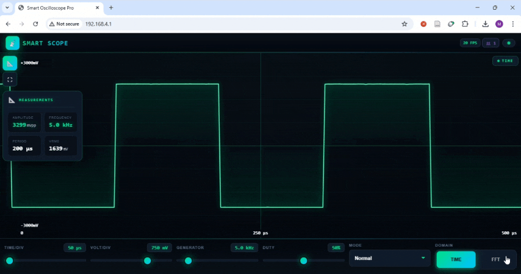
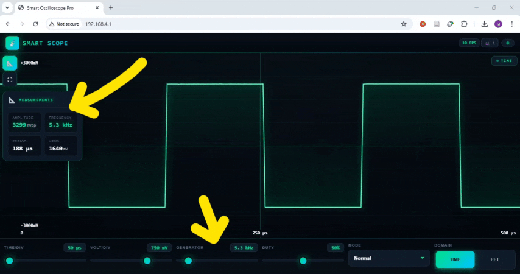
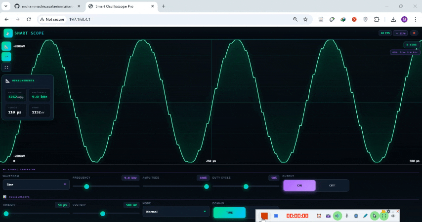
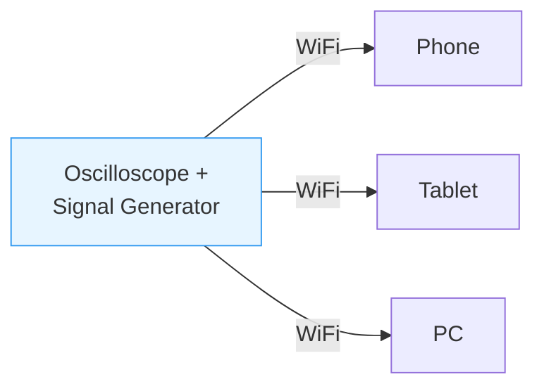
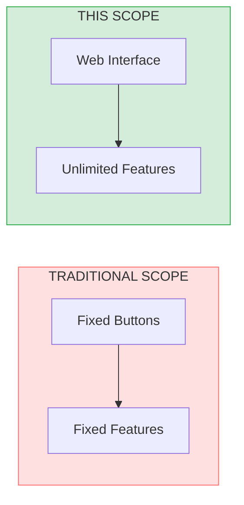

# WiFi Oscilloscope + Signal Generator — Custom PCB, ~$7 BOM

> A complete 1 MSPS oscilloscope with FFT spectrum analyzer and 7-waveform DDS signal generator — all on a custom 2-layer PCB for **1,131,000 Tomans (~$7)** per unit. No software, no cables — connect to WiFi, open a browser, measure and generate signals.
>
> For comparison: a Rigol DS1054Z costs ~45,000,000 Tomans in Iran. This board does scope + signal generator for 1,131,000 — from bare chips on a custom PCB, no dev boards.

  

  

  
   
  <em>⭐ NEW — 7-waveform DDS generator with loopback capture</em>

---

## The Problem

Traditional oscilloscopes require dedicated software, USB cables, driver configuration, and physical proximity to the device. Their features are limited by fixed buttons and hardcoded firmware — and most lack a built-in signal generator for quick self-testing.

---

## The Solution

```mermaid
flowchart LR
    SCOPE["Oscilloscope +<br>Signal Generator"] -->|"WiFi"| PHONE["Phone"]
    SCOPE -->|"WiFi"| TABLET["Tablet"]
    SCOPE -->|"WiFi"| PC["PC"]

    style SCOPE fill:#e7f5ff,stroke:#339af0
```

Power on → Connect to WiFi → Open browser → Measure and generate signals.

**No software. No cables. No drivers.**

---

## Key Features

<table>
<tr>
<td align="center" width="25%">
<h3>📡 Wireless First</h3>
WiFi AP mode 
No cables, no drivers 
Works with any device
</td>
<td align="center" width="25%">
<h3>📊 Spectrum Analyzer</h3>
4096-point FFT 
Hanning window 
Top 5 peak detection
</td>
<td align="center" width="25%">
<h3>🔊 Signal Generator</h3>
7 waveform types (DDS) 
PWM output (1 Hz – 100 kHz) 
Self-test without external gear
</td>
<td align="center" width="25%">
<h3>🛡️ Safe by Design</h3>
Hardware pull-down safe boot 
Schottky clamping 
±26 V input protection
</td>
</tr>
</table>

---

## Skills Demonstrated

> **For recruiters:** This is a complete end-to-end embedded systems design — analog, digital, firmware, networking, and frontend — taken from blank page to finished design files by one person. No dev boards, no off-the-shelf modules beyond the ESP32 and STM32 chips themselves.

| Domain | What I Did |
|--------|-----------|
| **Analog Design** | Custom AFE with relay-switched compensated attenuators, mux-switched PGA, single-supply level shifting, and Schottky protection — 3.3 V system handling ±26 V inputs |
| **Embedded C (STM32)** | Bare-metal HAL: timer-triggered ADC + DMA, CMSIS DSP 4096-pt real FFT, real-time auto-ranging control loop, hardware PWM generator, SPI master + UART inter-MCU comms |
| **Embedded C++ (ESP32)** | FreeRTOS multi-task: I2S-driven DDS pinned to core 1, SPI slave with DMA, async WebSocket server with per-client adaptive throttling, multi-client state sync |
| **DSP** | FFT with Hanning windowing, parabolic peak interpolation, exponential spectral averaging, EMA-filtered time-domain measurements, Schmitt-trigger zero-crossing detection |
| **Signal Generation** | DDS phase-accumulator + LUT via I2S DAC (7 waveforms), Galois LFSR white noise, STM32 TIM3 hardware PWM with runtime frequency and duty cycle control |
| **Web Frontend** | HTML5 Canvas oscilloscope UI, binary WebSocket streaming protocol, responsive controls, multi-client real-time state synchronisation |
| **PCB Design** | 2-layer layout: AGND/DGND star-point separation, antenna keepout, relay coil noise isolation, star-topology power distribution |
| **System Design** | Dual-MCU architecture isolating DSP from WiFi jitter, hardware safe-boot protection, DMA-everywhere zero-copy data path, adaptive streaming under variable client load |

---

## Why Web-Based Matters

```mermaid
flowchart LR
    subgraph TRAD["TRADITIONAL SCOPE"]
        B["Fixed Buttons"] --> F["Fixed Features"]
    end

    subgraph THIS["THIS SCOPE"]
        W["Web Interface"] --> U["Unlimited Features"]
    end

    style TRAD fill:#ffe0e0,stroke:#ff6b6b
    style THIS fill:#d4edda,stroke:#28a745
```

The hardware is the platform. The web interface is where intelligence lives — new features are added in pure software with zero hardware changes.

**Current:** Auto-ranging, FFT spectrum analysis, auto-measurements, adaptive streaming, multi-client viewing, dual signal generator

**Future (no hardware changes needed):** Protocol decoding, cloud logging, automated test scripting, remote lab access

---

## External Signal Test

  
   
  <em>🔊 Click to watch with audio — measuring audio signal from a phone</em>

> **Note:** Captures above were taken on the breadboard build.  The time and
> frequency domain demos show v1 with PWM-only generation.
> The generator demo shows the current DDS engine with 7 waveform types.

---

## Specifications

| Parameter | Value |
|-----------|-------|
| **Oscilloscope** | |
| Sample Rate | 1 MSPS (timer-triggered ADC + DMA) |
| Resolution | 12-bit |
| Bandwidth | DC — 500 kHz |
| Input Range | ±137 mV to ±26 V (auto-ranging, 32 gain steps) |
| FFT | 4096-point, Hanning window, top 5 peaks with parabolic interpolation |
| Acquisition Modes | Normal · Average · Peak Detect |
| Auto-Measurements | Frequency, Vpp, Vmax, Vmin, Vrms, Duty Cycle |
| Display | Browser HTML5 Canvas (any device) + SSD1306 OLED 128×64 |
| Max Clients | 8 simultaneous WebSocket connections |
| **Signal Generator** | |
| STM32 PWM | Square wave · 1 Hz – 100 kHz · 1–99% duty cycle |
| ESP32 DDS | Sine · Square · Triangle · Sawtooth · Ramp Down · Noise · DC |
| DDS Architecture | 32-bit phase accumulator + 4096-entry LUT via I2S DAC |
| Amplitude | Software-adjustable (0–255) |
| Noise | 32-bit Galois LFSR — flat spectrum white noise |

---

